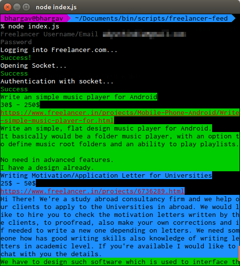

#FLSocketFeed

A `nodejs` script that taps [www.freelancer.com](http://www.freelancer.com) notification feed and shows them in terminal *realtime! with colors\**

##Prerequisites
* Node and npm

##How to run
* Checkout the repository
* Install the dependencies by `npm install`
* Run the script `node index.js`
